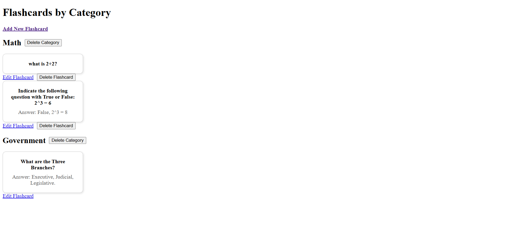
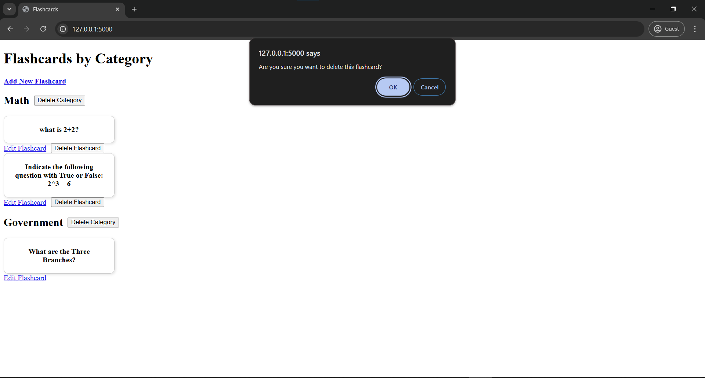
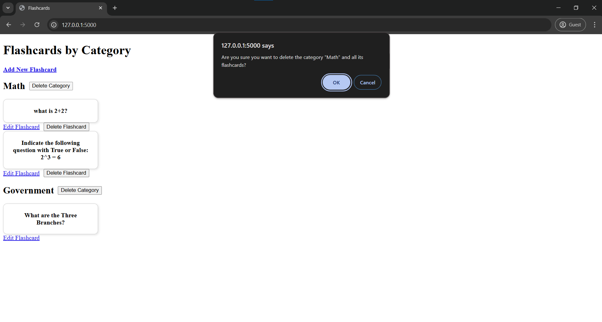
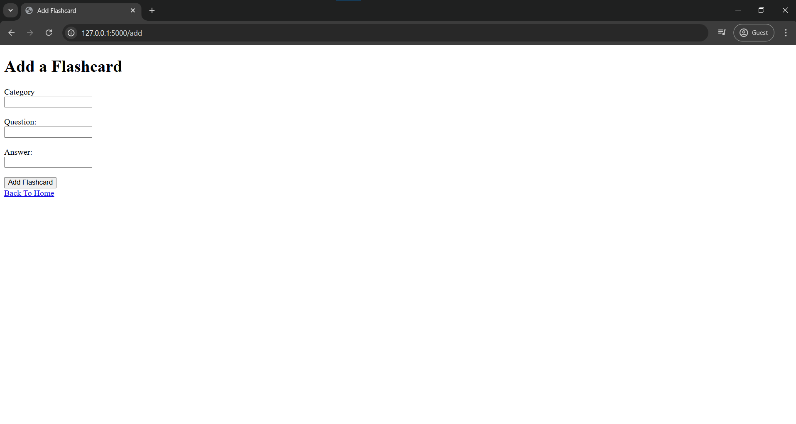
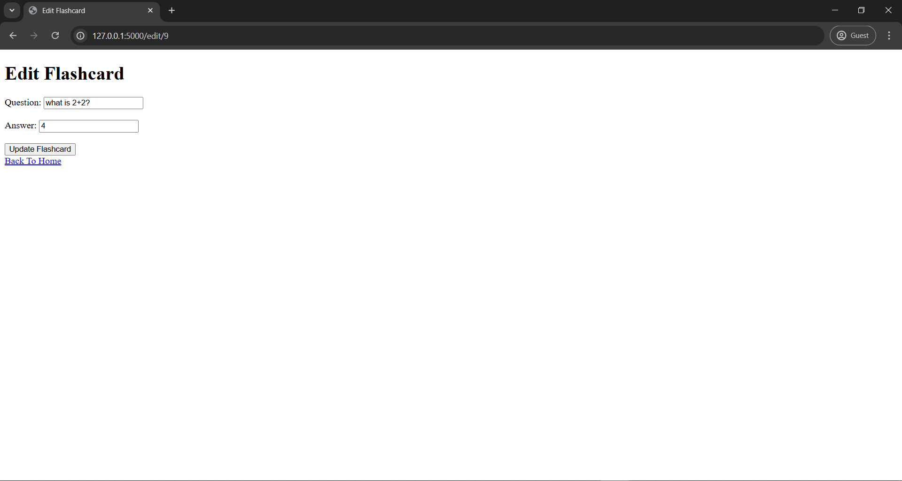

# Flashcards Web App

Web application for creating, sorting, editing, and deleting flashcards by category.
Made with Python using Flask. Database done using SQLite, website made using HTML, CSS, and Javascript for user confirmation.

---

## Features
- Create Flashcard: Add flashcards with question, answer and category
- Edit Flashcards
- Delete Flashcards
- Organize by Category
- Delete Categories - Removes category, along with the flashcards that are in the specified category

## Pages

- Homepage:
    - Allows for creation of flashcards and categories. Also allows for deletion and editing of existing flashcards. Sorts flashcards by category.
- Add Flashcard:
    - Prompts user to enter Category, Question, and Answer to create a new flashcard, can also make a new category.
- Edit Flashcard: 
    - Allows user to alter existing flashcard's Question and Answer.

---

## Files:
```
Flashcards-App:
|-- app.py (Main Application - Handles backend calls from frontend in order to alter our database)
|-- flashcard_creation.py (Creating our table (flashcards.db))
|-- flashcards.db (Database - Dependent on flashcard_creation.py)
|-- templates (HTML files)
  |-- index.html (Home website)
  |-- add_flashcard.html (Webpage user is redirected to when prompted to add a new flashcard)
  |-- edit_flashcard.html (Webpage when user chooses to edit a flashcard)
|-- static (CSS and Javascript files)
  |-- scripts.js (Javascript code implemented in our HTML)
  |-- style.css (Design for webpage)
|-- readme.md (Project Documentation)
|-- images (Website Images)

```


## Web Application Images:

- Homepage:



- Deletion Confirmation:

Flashcard:



Category:



- Add Flashcard Page:



- Edit Flashcard Page:



